# 📙 AWS setup

# Renting a virtual machine

Go to [AWS](https://aws.amazon.com/free/) and create a free account.

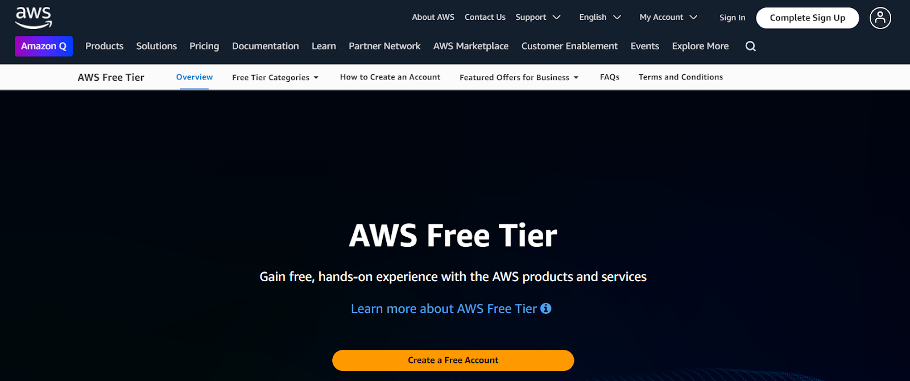

Fill in all data. You’ll need a bank card and mobile phone number to verify account

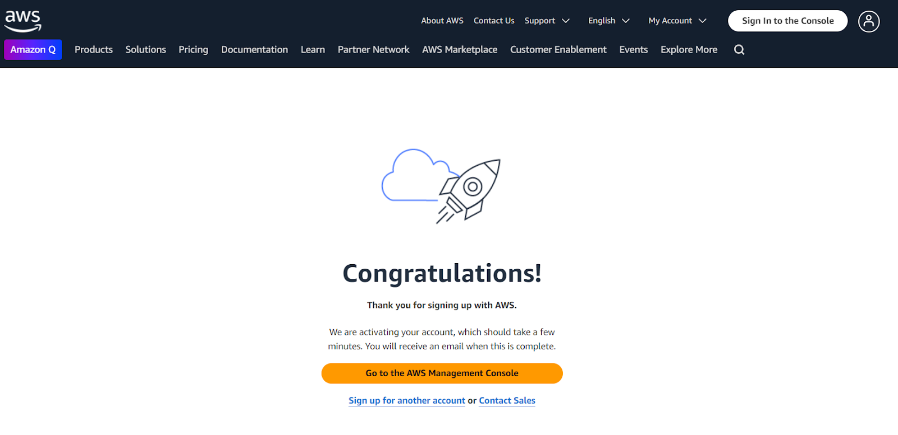

Then go to AWS Management Console. 

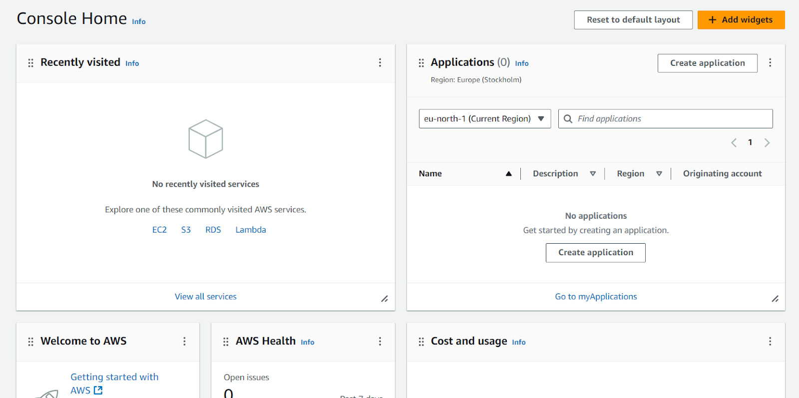

From here we go to EC2 Dashboard:

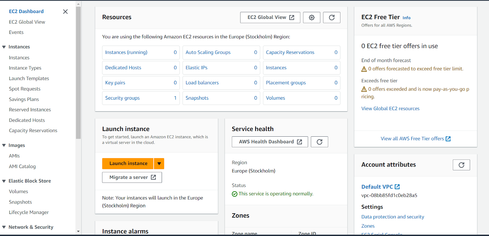

Then go to Launch instance

*It will tell that instance will be launched in a chosen zone. Zone has not much of a difference, especially on free tier, but you can choose it on top right.*

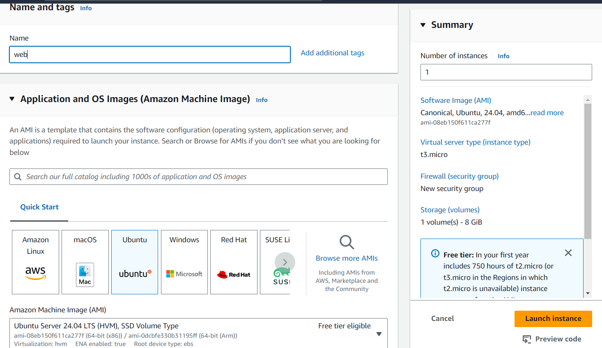

Name your instance and choose OS, we’ll go with Ubuntu here.

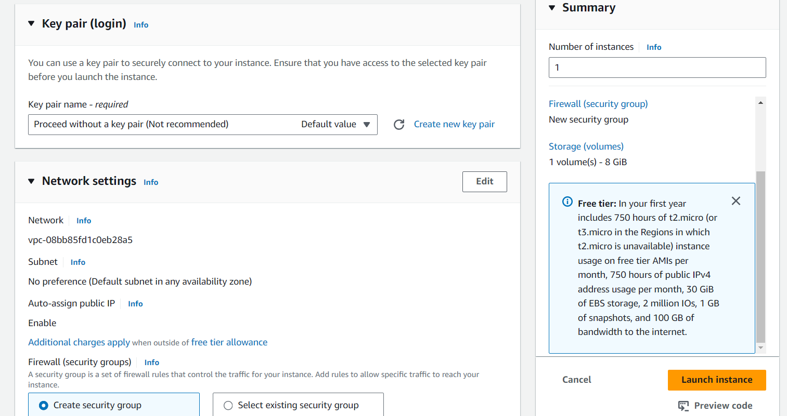

Under it, near Key pair click “Create new key pair” — you’ll use it to connect to machine from yours. I choose ED25519 algorithm.

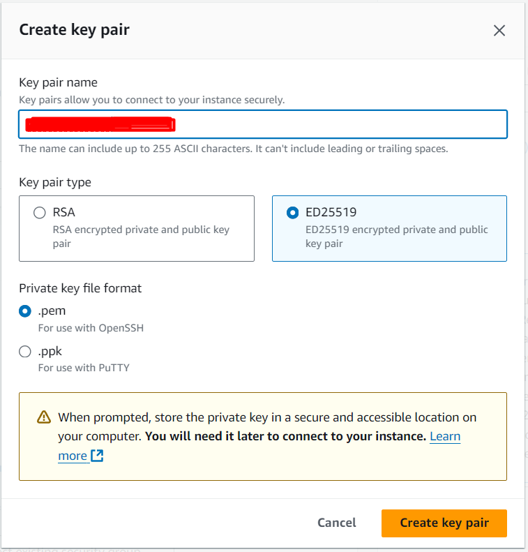

*In network settings ideally we have to change SSH traffic from anywhere to our IP (DON’T FORGET TO TURN OFF VPN), but it will require additional setup when configuring deployment, so we’ll skip it for now)*

Also, as we are setting up a webservice, tick https & http traffic options.

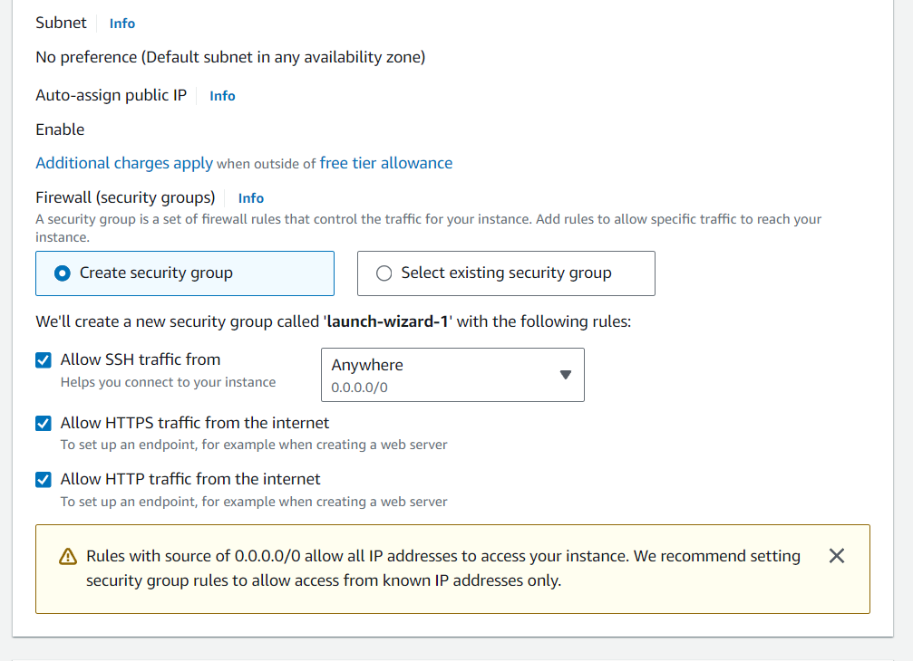

Now to storage

Free tier claims to work with up to 30 gb, let’s do this!

After this step (and making sure nothing is missed) click “Launch instance”.

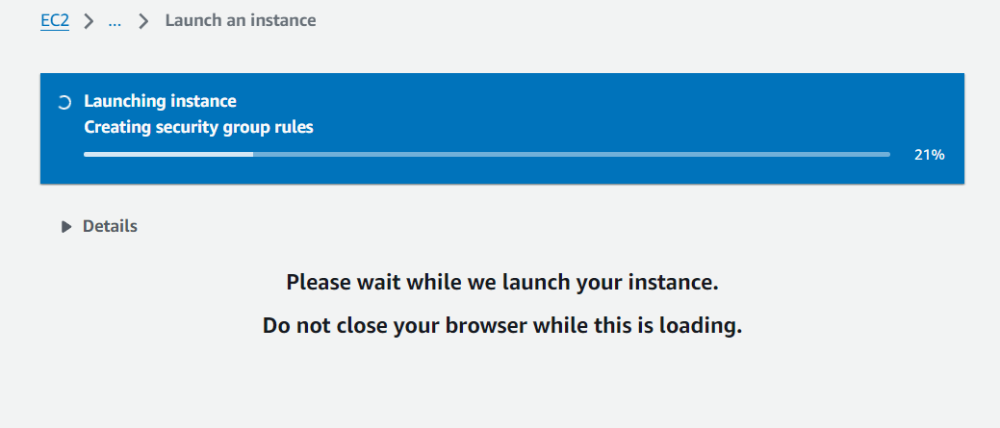

It won’t take long.

You’ll see green success indicator and after this you may go to see your instance via “View all instances” on the bottom right

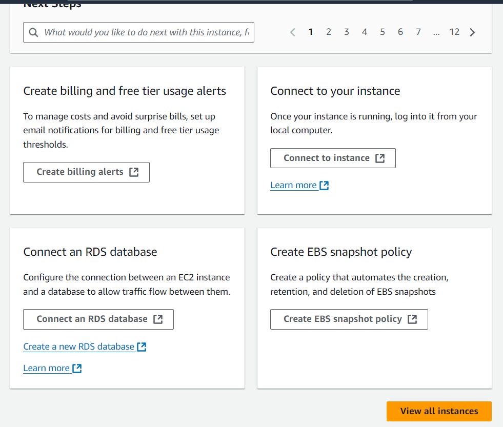

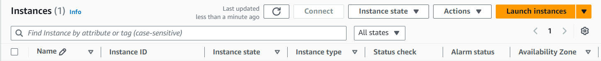

After this you are able to connect to it via your key, saved during configuration steps, congrats!

# Connecting to our virtual machine

We can connect to our machine from browser via AWS. You may try it by selecting your machine, going to Actions → Connect.

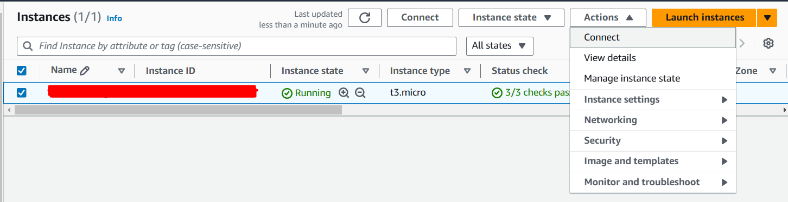

However, I would recommend using local console more as more flexible and convenient tool.

To do that, from your local unix console change the permissions for downloaded key:

`chmod 400 keyname`

After this use ssh connect command using our key:

`ssh -i path-to-key ubuntu@your-machine-public-ip` where ubuntu is the default user on AWS machine with Ubuntu OS, and your-machine-public-ip can be found in AWS Console Instances page near our newly created one.

And you are in!

If something is not working, verify your key placement, double check IP and instruction steps.

You may also check security permissions in Security groups from the left menu, under the Network & Security

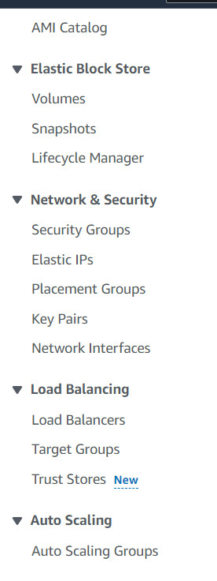

But if you followed all steps, we haven’t restricted the access yet.

You may also let your machine some time to initialize properly ☕. Once you are in, let’s continue!

See you in [the next chapter](Next-parts.md).

[**NEXT PAGE**](Next-parts.md)