# 📘 GCP setup

# Renting a virtual machine

Go through simple signup via free trial registration link: [GCP free trial](https://console.cloud.google.com/freetrial).

Once we are ready, from the main page of our account we scroll to Products section and click Create a VM.

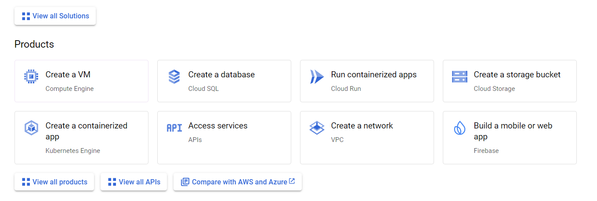

As it is a new account, it will at first redirect us to Compute Engine API, where we have to click enable (here I have already clicked and waiting for it to be activated).

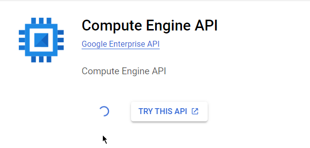

After that, we will be redirected to VM instances page

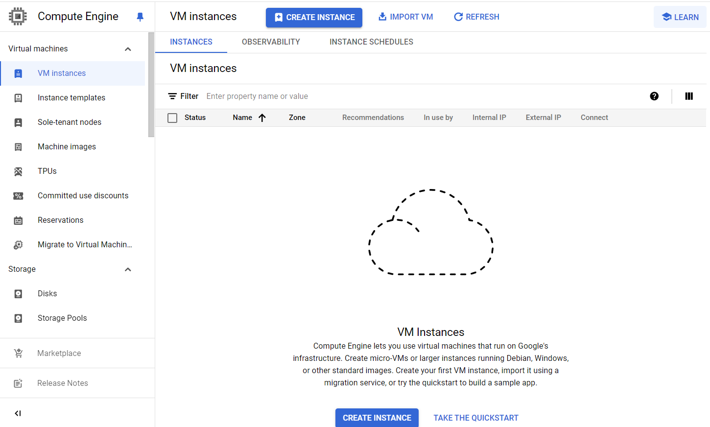

Click Create instance (blue button on top or on bottom)

There we will see the basic characteristics for your new machine.

We can rename it here, change region, zone, machine type and other parameters.

Since we have created a new account, we have Google credits for testing services. There is also a free tier, but we need to make sure we follow instructions to use it. **For free** (even for no credits) **we may use only e2 micro** (0.25 cpu) machines **in three regions: us-east, us-central and us-west**.

Other machine types will cost us money (at first credits will be used).

However, it might be confusing to see the price on the right anyway. Don’t worry, that’s just a basic price we would pay AFTER finishing trial period. It won’t be substracted from 300$ credits you got either. 

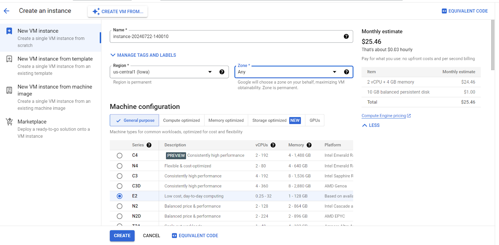

Usually for computations and server logic E2 is a good choice.

But do not rush into creating machine as it is, because default settings are not what we might expect.

To change machine type, click on the e2-medium combobox under the Machine type

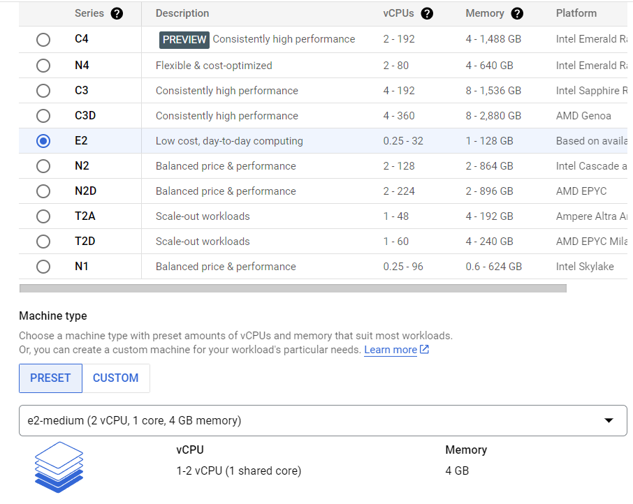

We will see the free **e2-micro** instance there in Shared-core category, its usual price would be about 7.11$. However, as it is the only machine, we won’t even pay for it thanks to the free tier.

Also, later you will be able to upgrade it if free tier resources are not enough. If you do, the smallest part of credits will be withdrawn, but it still would be more than enough even if you try lots of paid services during this period.

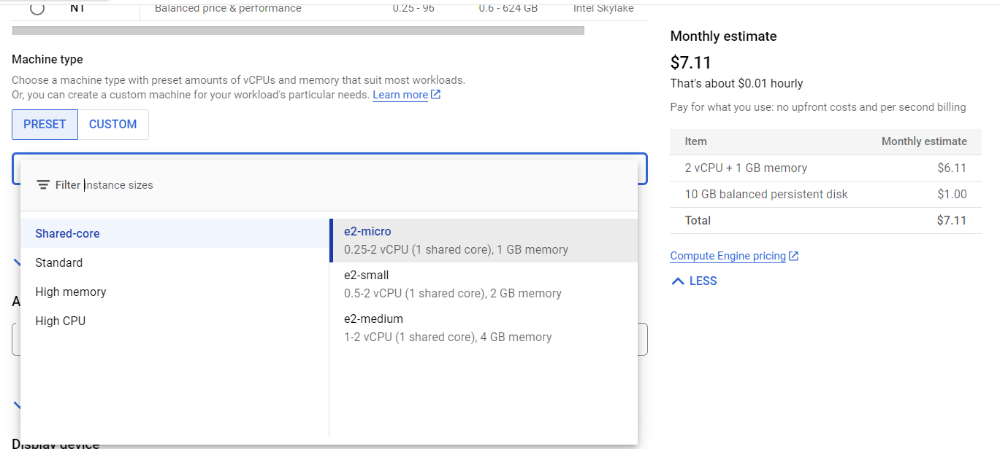

Next few settings we’ll leave like this

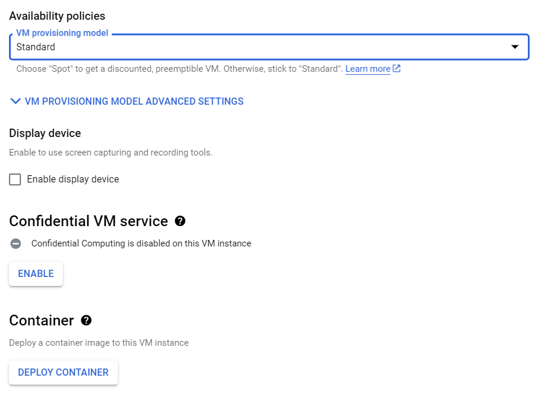

And will scroll to Boot disk

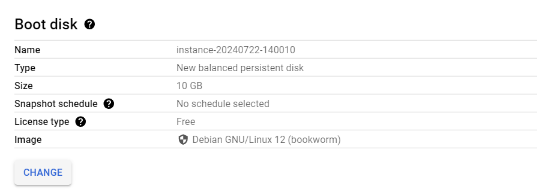

Here you can choose preferred OS for your machine. Default one is Debian, but let’s go with Ubuntu. So we click “CHANGE” and choose Ubuntu.

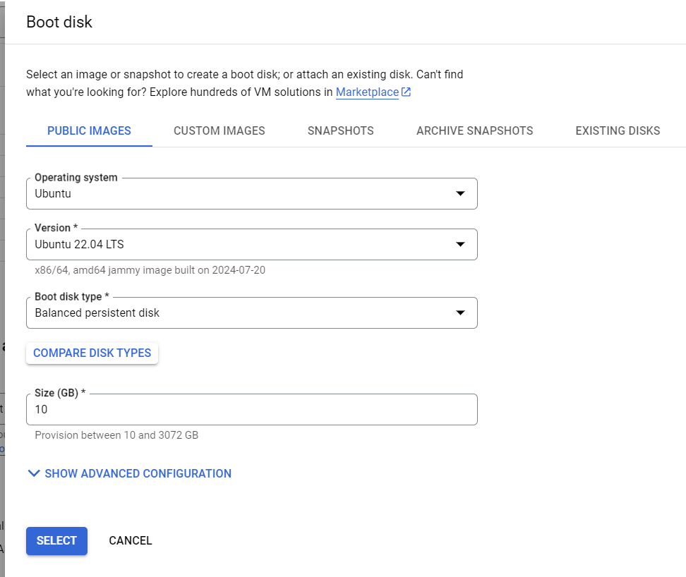

In the opened popup we can also set the disk size and boot disk type. These parameters change leads to price updates. Let’s go with defaults for now.

We can also load custom images or snapshots, archived snapshots and other existing disks here. For now, assuming we have a fresh account, we won’t touch it and go with a public new image.

Under advanced configuration we can also set up extra parameters, such as deletion rule, encryption and other

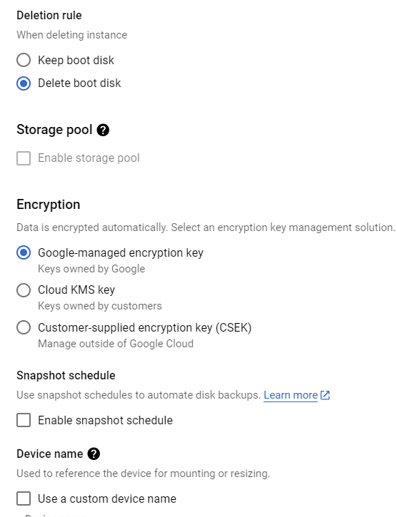

Next we will make sure we can access server via HTTP and HTTPS and allow Health Checks.

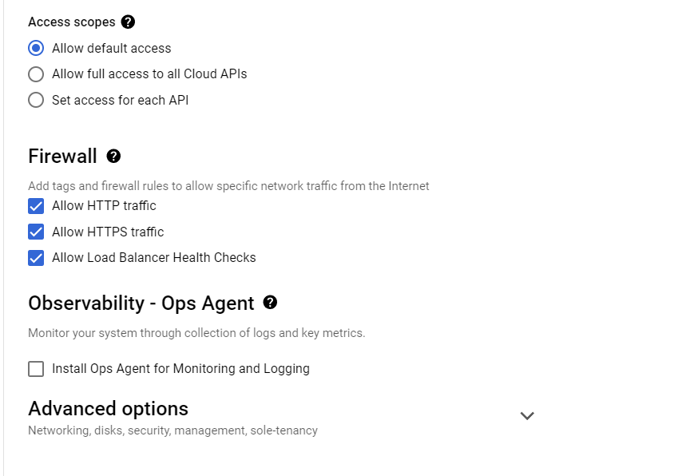

Under Advanced options we can also modify several things, like allow access to VM only from some users, 2-step verification (security recommended, but you can do it later)

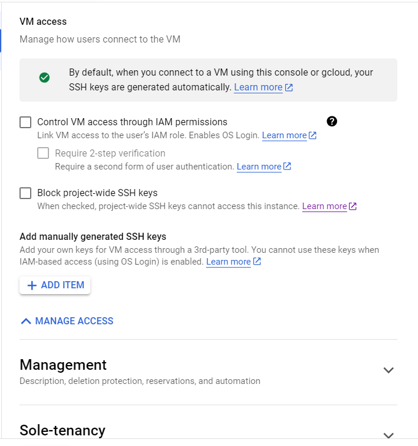

Under the Management section we may also add a Startup script, the code which will be launched automatically when the machine boots. But we don’t do it now.

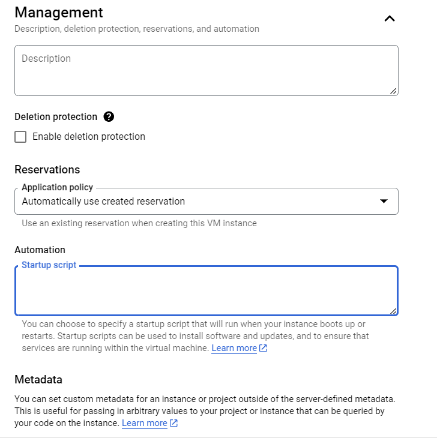

After setting these things up, let’s click CREATE on bottom.

We will next see the VM instances page with our newly created machine preparing, it may take several minutes, so we can do quick warm up or make a cup of something to drink ☕

We will see the machine is ready when green tick is next to it and IPs are set.

# Connect to instance

To launch the instance from Google console click SSH button in the VM line.

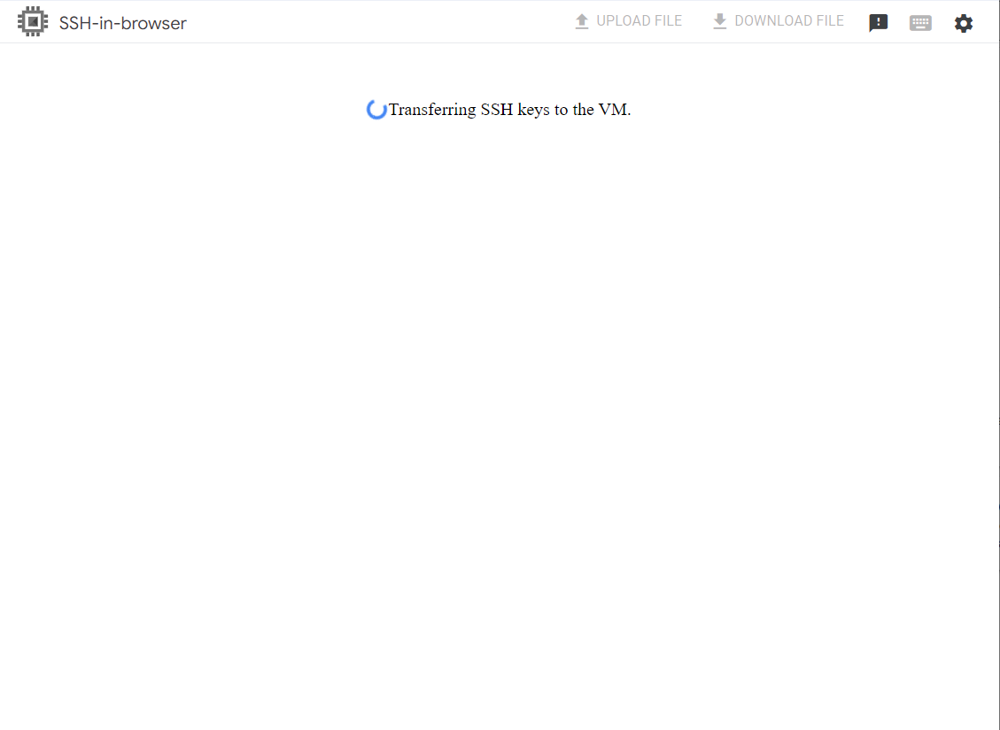

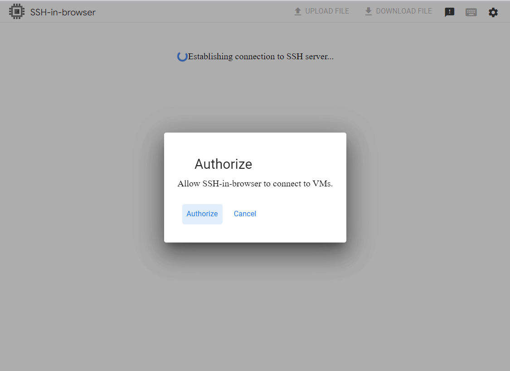

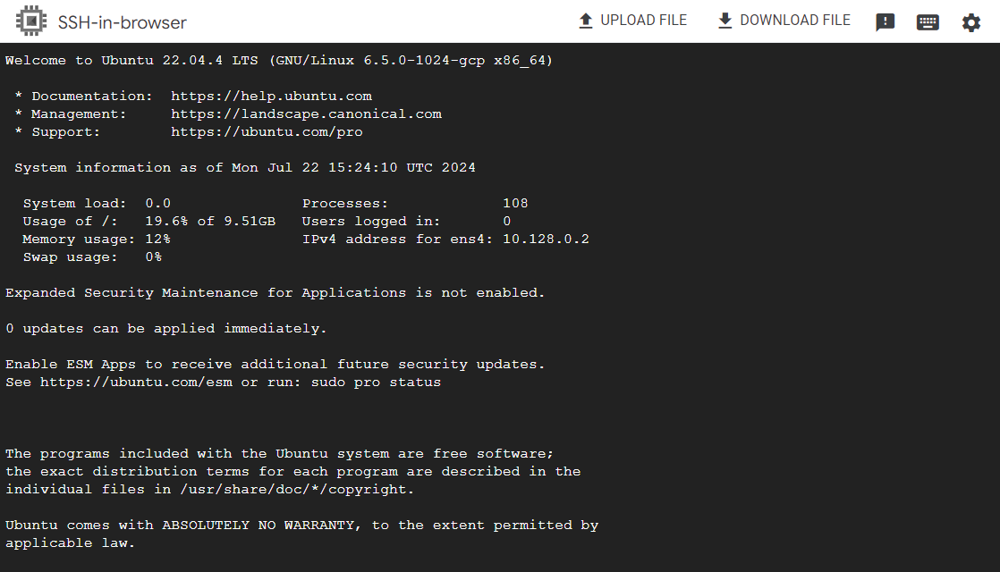

And you are in!

By the way, via Google console SSH window you can easily upload some files to your machine (works well with small ones at least).

Now we can set up the VM for work.

However, let’s make sure we can connect from our local console.

For that go to local console and type

`ssh-keygen -t rsa -f ~/.ssh/*keyfilename* -C *username*`

where the username on our virtual machine by default is your email part before @ symbol; keyfilename is up to you, but better make it recognizable as we will use it every time we need to connect to our virtual machine.

*Also, note that GCP doesn’t accept ED25519 keys, but RSA only (at least in November 2024 it is like that)*

Command above generates a public and secret key.

Now, we have to put the public one to GCP to be able to connect. We’ll do it once and you will be able to use it for any machines you may later create within our project (the one chosen near Google Cloud).

For that, in the GCP console on the left panel scroll down to Metadata.

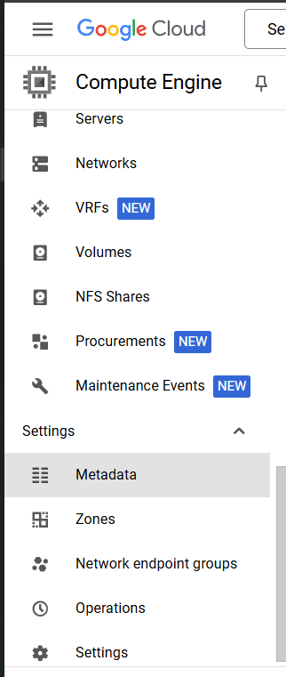

In an opened page you will see SSH Keys tab

Click ADD SSH KEY

In our local console view and Ctrl+C the public key

`cat ~/.ssh/keyfilename.pub`, copy it and paste to the Google Cloud metadata key field. Click SAVE.

Now we can connect from our machine:

`ssh -i ~/.ssh/keyfilename username@machine_public_ip`

where machine_public_ip is the IP you see near your instance on GCP and username is the same machine username (part before email used to sign up on GCP)

You should log in without problem, however sometimes you may need to manually add public key to ~/.ssh/authorized_keys file on Google virtual machine. 

For that, connect via browser as shown at the beginning of this chapter and type in console

`sudo nano .ssh/authorized_keys`

If your public key is not there, paste it (with mouse right click) and Ctrl+X to save the file.

If the key is there – double check your connection line from local console 🙂

Congrats on finishing this part! Let’s go to [the next chapter](Next-parts.md).

[**NEXT PAGE**](Next-parts.md)